## Pre-requisites ##

* Basic knowledge of Java is preferable.
* Must have a personal windows machine.
* Must have a Google Cloud Platform account.

  Follow the guide below to create one.

## Intellij IDEA Download ##

* Download the community version of IDEA. [Click here](https://www.jetbrains.com/idea/download/?section=windows).
* **Leave the installation part.** Just download the setup file.

## Docker Desktop Download 
* [Click here](https://www.docker.com/products/docker-desktop/) to download the **latest version** of docker desktop.
* **Leave the installation part.** Just download Docker Desktop.

## Step-by-step guide for setting up your GCP account ##
#### Go through the documentation to set up your GCP account hasle free ####

* 
    Create a google account. Now, it is recommended to not use your personal account as you might want to keep your account mail box clutter free from all the cloud alerts that you will be recieving in the future.

    [Click here](https://www.google.com/account/about) and you will be redirected to the google account page. After, the page is loaded click on `create an account`.

    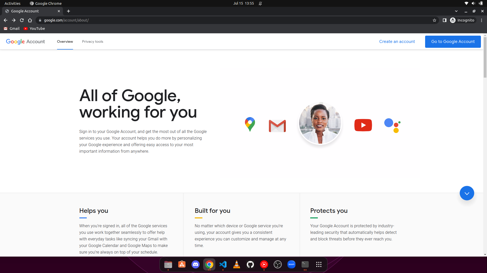

    Fill in your personal details.

    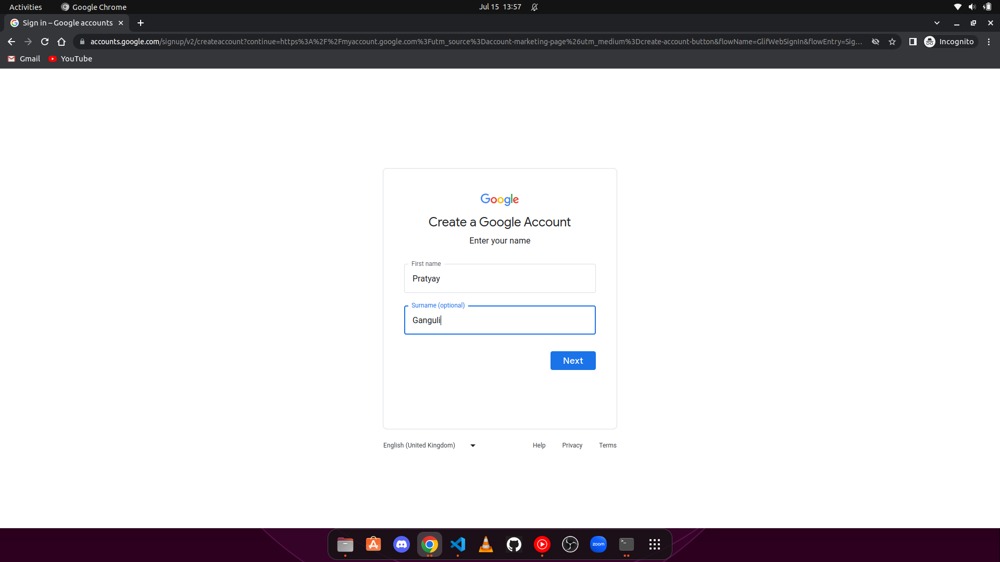

    Select your DOB and gender.

    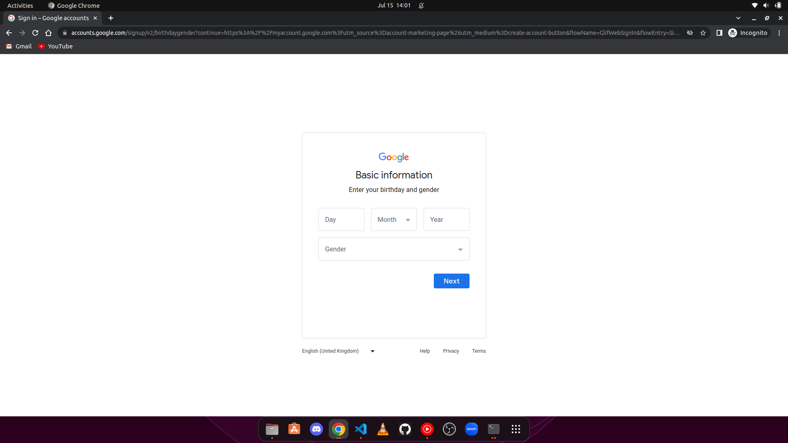

    Select a recommended email address.

    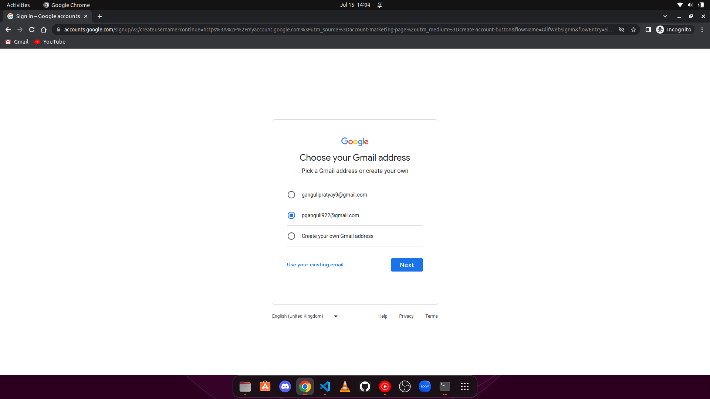

    Create a strong password. Do not use commonly used passwords. You will be using the same password for your **Google Cloud Platform** account.

    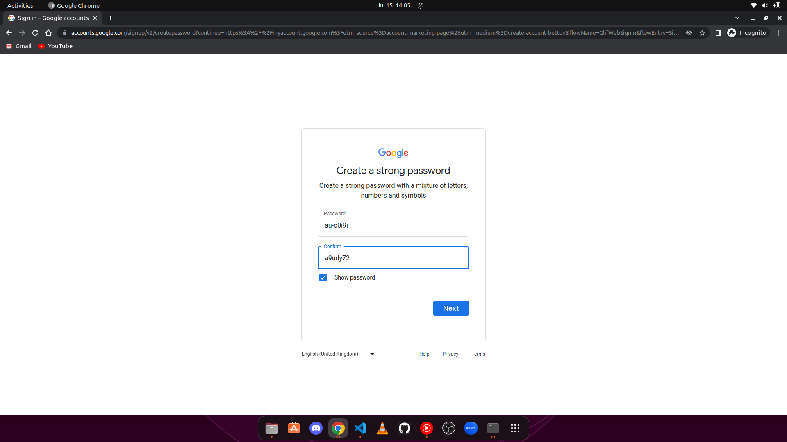

    Add a valid phone number. You can also enable 2FA later.

    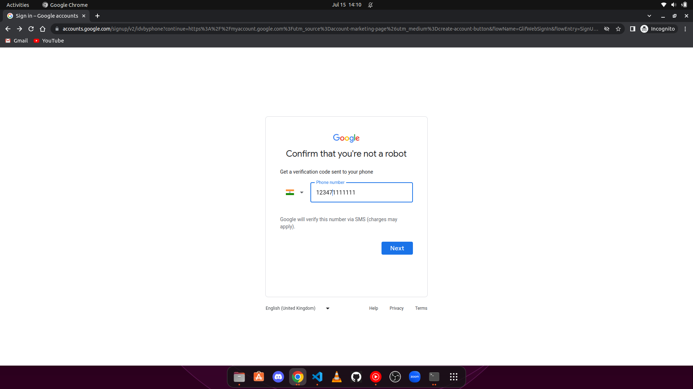

    Click on `yes,I'm in` and your google account is ready for use.

    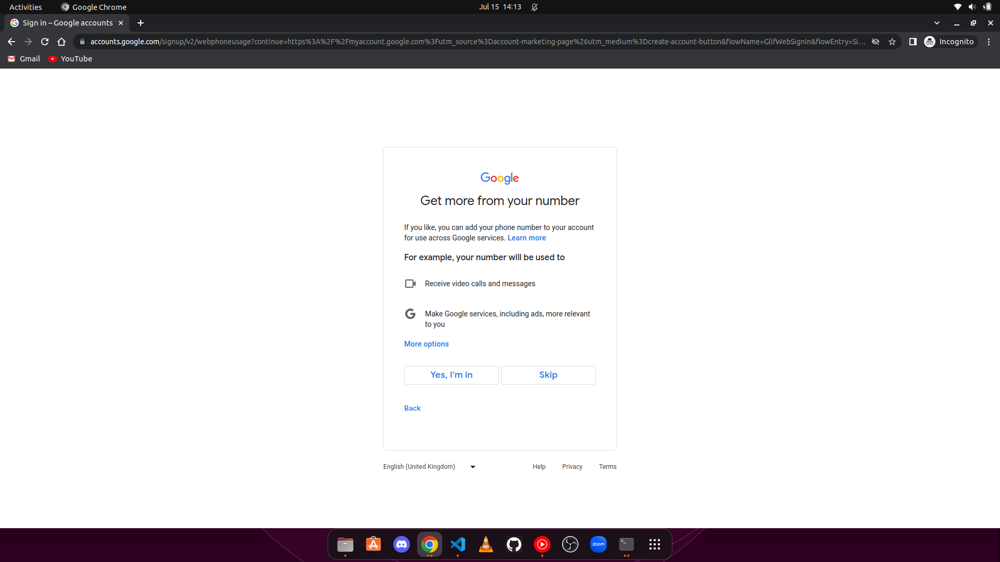
    
* 
    Once you have your google account all set. [Click here]( https://cloud.google.com) to redirect to GCP home page.

    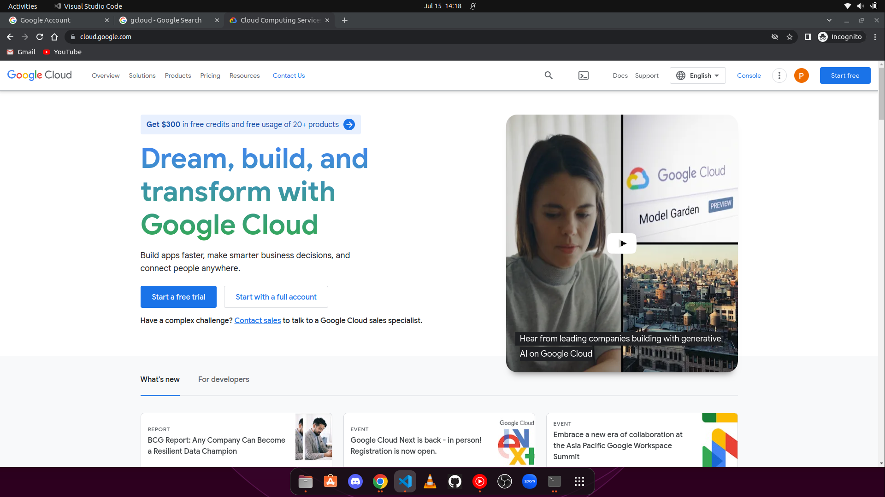

    Once you start your free trial, GCP gives you $300 free credits valid for 3 months. So, click on start a free trial.

*
    **Setting your billing accout** :

    Provide all the necessary account information and click on continue.

    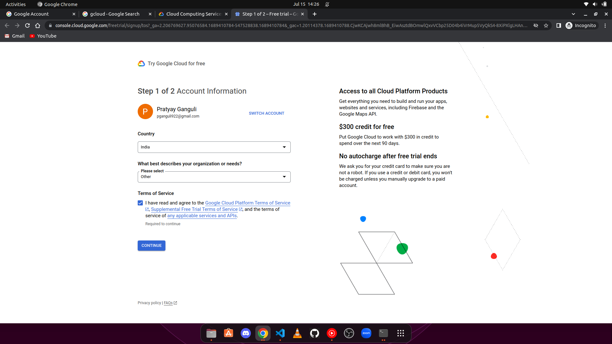

    Now, for that free trial to work. You need to add your credit/debit card. You won't be charged unless you exhaust your free $300 credit.

    _Note :_  
    * **It is always a good thing to check your billing to keep a track of the services you are using on GCP.**

    * **Only international cards like Visa / Mastercard / American Express are supported till date.**

    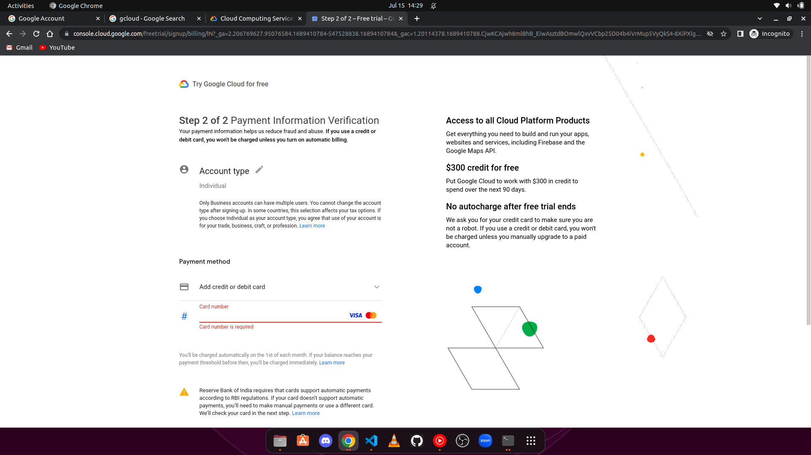

    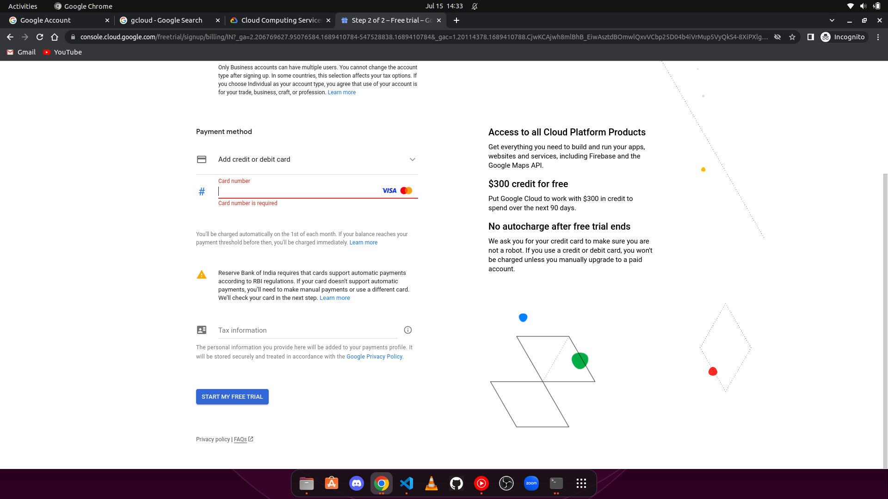

    After, you add your card you'll recieve your free credits in your account which you'll need for running different cloud services.

_Post completion of all these steps sit tight and relax. Your GCP account is ready for use_ :+1:
